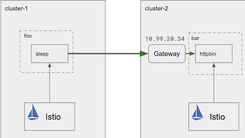

# Istio multiclusters

Configurating an [Istio](https://istio.io/) mesh spanning multiple Kubernetes clusters.

There are two control plane variants:

* **[Replicated control planes](#replicated-control-planes)** -
  Install an Istio mesh across multiple Kubernetes clusters with replicated control plane instances.
  
* **Shared control plane (single and multiple networks)** -
  Install an Istio mesh across multiple Kubernetes clusters with a shared control plane.
  
## Replicated control planes
[source](https://istio.io/docs/setup/install/multicluster/gateways/)

Follow instructions below to configure minikube playground with **two** clusters.

!!! info
    Below commands works on macOS  system

### Configure minikube clusters

Install minikube:

``` bash
brew install minikube
```

Clear all minikube clusters:
``` bash
minikube delete --all
```

Create two minikube docker driven clusters:

``` bash
minikube start --driver virtualbox -p cluster-1
```
``` bash
minikube start --driver virtualbox -p cluster-2
```

Check clusters:
``` bash
kubectl config get-contexts
```

Change cluster:
``` bash
minikube profile cluster-1
```

Download istio with service example:
``` bash
curl -L https://istio.io/downloadIstio | ISTIO_VERSION=1.5.4 sh -
cd istio-1.5.4
export PATH=$PWD/bin:$PATH
echo $PATH
```

Save clusters names to variables:

``` bash
export CTX_CLUSTER1=$(kubectl config view -o jsonpath='{.contexts[0].name}')
export CTX_CLUSTER2=$(kubectl config view -o jsonpath='{.contexts[1].name}')
echo CTX_CLUSTER1 = ${CTX_CLUSTER1}, CTX_CLUSTER2 = ${CTX_CLUSTER2}
```

!!! warning
    Be sure your path is set `export PATH=$PWD/bin:$PATH`


### Install istio in each cluster

Create istio namespace:

``` bash 
kubectl create --context=$CTX_CLUSTER1 namespace istio-system
kubectl create --context=$CTX_CLUSTER2 namespace istio-system
```
Configure CA:

``` bash 
kubectl create --context=$CTX_CLUSTER1 secret generic cacerts -n istio-system \
    --from-file=samples/certs/ca-cert.pem \
    --from-file=samples/certs/ca-key.pem \
    --from-file=samples/certs/root-cert.pem \
    --from-file=samples/certs/cert-chain.pem
    
kubectl create --context=$CTX_CLUSTER2 secret generic cacerts -n istio-system \
    --from-file=samples/certs/ca-cert.pem \
    --from-file=samples/certs/ca-key.pem \
    --from-file=samples/certs/root-cert.pem \
    --from-file=samples/certs/cert-chain.pem
```
Install istio:

``` bash
istioctl manifest --context=$CTX_CLUSTER1 apply \
    -f install/kubernetes/operator/examples/multicluster/values-istio-multicluster-gateways.yaml
    
istioctl manifest --context=$CTX_CLUSTER2 apply \
    -f install/kubernetes/operator/examples/multicluster/values-istio-multicluster-gateways.yaml
```

### Setup example services

Deploy sleep service on first cluster:
``` bash
kubectl create --context=$CTX_CLUSTER1 namespace foo
kubectl label --context=$CTX_CLUSTER1 namespace foo istio-injection=enabled
kubectl apply --context=$CTX_CLUSTER1 -n foo -f samples/sleep/sleep.yaml
export SLEEP_POD=$(kubectl get --context=$CTX_CLUSTER1 -n foo pod -l app=sleep -o jsonpath={.items..metadata.name})
kubectl get services --namespace foo --context $CTX_CLUSTER1
```

Deploy the httpbin service in second cluster:
``` bash
kubectl create --context=$CTX_CLUSTER2 namespace bar
kubectl label --context=$CTX_CLUSTER2 namespace bar istio-injection=enabled
kubectl apply --context=$CTX_CLUSTER2 -n bar -f samples/httpbin/httpbin.yaml
kubectl get services --namespace bar --context $CTX_CLUSTER2
```

Show services:
```bash
echo -e "\n $CTX_CLUSTER1 services:"
kubectl get services --namespace foo --context $CTX_CLUSTER1
echo -e "\n $CTX_CLUSTER2 services:"
kubectl get services --namespace bar --context $CTX_CLUSTER2
echo -e "\n"
```

Check if load balancer is enabled:
``` bash
kubectl get svc istio-ingressgateway -n istio-system
```

If not (<pending\> state in external ip) run in new terminal:
```bash
minikube profile $CTX_CLUSTER2
minikube tunnel
```

External IP should be visible (external ip should not be in <pending\> state)

Now, get second cluster gateway address:

``` bash
export CLUSTER2_GW_ADDR=$(kubectl get --context=$CTX_CLUSTER2 svc --selector=app=istio-ingressgateway \
    -n istio-system -o jsonpath='{.items[0].status.loadBalancer.ingress[0].ip}')
echo -e "\nIP: $CLUSTER2_GW_ADDR"
```

### Configure Gateway

Cluster-2 gateway configuration:

```bash
kubectl apply --context=$CTX_CLUSTER2 -f - <<EOF
apiVersion: networking.istio.io/v1alpha3
kind: Gateway
metadata:
  name: httpbin-gateway
spec:
  selector:
    istio: ingressgateway
  servers:
  - port:
      number: 80
      name: http
      protocol: HTTP
    hosts:
    - "httpbin.example.com"
EOF
```

Virtual service configuration:
```bash
kubectl apply --context=$CTX_CLUSTER2 -f - <<EOF
apiVersion: networking.istio.io/v1alpha3
kind: VirtualService
metadata:
  name: httpbin
spec:
  hosts:
  - "httpbin.example.com"
  gateways:
  - httpbin-gateway
  http:
  - match:
    - uri:
        prefix: /status
    - uri:
        prefix: /delay
    route:
    - destination:
        port:
          number: 8000
        host: httpbin.bar.svc.cluster.local
EOF
```

Check communication from one cluster to another



```bash
kubectl exec --context=$CTX_CLUSTER1 $SLEEP_POD -n foo -c sleep -- curl -I -H 'Host:httpbin.example.com' $CLUSTER2_GW_ADDR:80/status/200
```

It should return **HTTP 200** ok status
